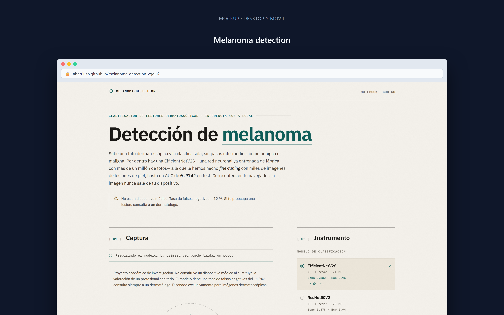
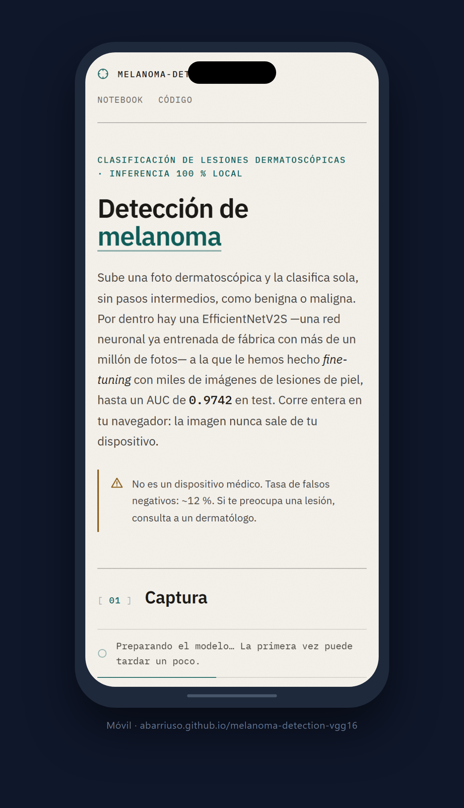

# Detección de melanoma con transfer learning (VGG16 · ResNet50V2 · EfficientNetV2S)

[English](README.md) · **Español**

Clasificación binaria de imágenes dermatoscópicas (benigno / maligno) mediante
*transfer learning*. Se comparan tres arquitecturas de referencia con un
protocolo idéntico y se sirve el modelo seleccionado para la demo web, que ejecuta
la inferencia en el navegador del usuario.


**Demo en vivo:** https://abarriuso.github.io/melanoma-detection/ (en inglés y en español)

## Capturas

| Escritorio | Móvil |
|:---:|:---:|
|  |  |

> **Aviso.** Este es un proyecto académico y una prueba de concepto. **No es un
> dispositivo médico, no está validado clínicamente y no debe usarse para tomar
> decisiones de salud.** Sus resultados se obtienen sobre un único conjunto de
> datos público y no representan el rendimiento en condiciones clínicas reales.
> Ante cualquier lesión sospechosa, consulta a un dermatólogo. Texto completo en
> [DISCLAIMER.md](DISCLAIMER.md).

---

## Índice

- [Motivación y alcance](#motivación-y-alcance)
- [Datos](#datos)
- [Metodología](#metodología)
- [Modelos comparados](#modelos-comparados)
- [Resultados](#resultados)
- [Interpretabilidad y calibración](#interpretabilidad-y-calibración)
- [Arquitectura del sistema](#arquitectura-del-sistema)
- [Estructura del repositorio](#estructura-del-repositorio)
- [Instalación y uso](#instalación-y-uso)
- [Limitaciones](#limitaciones)
- [Consideraciones éticas y clínicas](#consideraciones-éticas-y-clínicas)
- [Referencias](#referencias)
- [Licencia y datos](#licencia-y-datos)
- [Autor](#autor)

---

## Motivación y alcance

El melanoma es uno de los cánceres de piel más agresivos, y la evidencia
clínica asocia su detección temprana con un mejor pronóstico [1]. En la última
década, las redes neuronales convolucionales (CNN) han demostrado capacidad para
clasificar lesiones cutáneas a partir de imágenes, en algunos estudios a un nivel
comparable al de dermatólogos sobre conjuntos de test acotados [2]. Conviene
subrayar que esos resultados se obtienen en condiciones controladas y no
equivalen a validación clínica.

El alcance de este trabajo es **educativo**: reproducir, con rigor y de forma
transparente, un flujo completo de clasificación binaria (benigno / maligno) —
desde el entrenamiento hasta el despliegue— y comparar tres arquitecturas
conocidas. No se persigue un sistema de diagnóstico ni se afirma utilidad
clínica.

## Datos

Se utiliza el *Melanoma Skin Cancer Dataset* (10 000 imágenes, licencia CC0)
publicado en Kaggle [3]. El conjunto está dividido en entrenamiento y test, con
una partición interna 80/20 para validación. El test contiene 1 000 imágenes,
500 por clase.

**Sesgos conocidos del conjunto** (relevantes para interpretar los resultados):

- Está **balanceado artificialmente al 50/50**. La prevalencia real del melanoma
  en la práctica clínica es muy inferior, por lo que el valor predictivo positivo
  observado aquí no es trasladable a un entorno real [4].
- No documenta la distribución de fototipos de piel, el equipamiento ni las
  condiciones de captura. Un modelo entrenado así puede generalizar mal a
  poblaciones o dispositivos distintos.
- Es un único origen de datos: sin validación externa no puede estimarse la
  generalización fuera de dominio.

## Metodología

El protocolo es común a las tres arquitecturas para que la comparación sea justa:

- **Transfer learning** desde pesos preentrenados en ImageNet [5], técnica
  estándar cuando el conjunto objetivo es pequeño [6].
- **Entrenamiento en dos fases:** (1) extracción de características con el
  *backbone* congelado (RMSprop, lr 1e-4); (2) *fine-tuning* de las capas altas
  (Adam, lr 1e-5–1e-6). *Callbacks*: `ModelCheckpoint` (mejor `val_loss`),
  `EarlyStopping` y `ReduceLROnPlateau`.
- **Data augmentation** solo en entrenamiento: volteos, rotación, zoom, traslación,
  brillo y contraste.
- **Ponderación de clases** `class_weight = {0: 1.0, 1: 1.3}` para penalizar más
  el error sobre la clase maligna y favorecer la sensibilidad [4].
- **Reproducibilidad:** semilla fija (42), entrada 224×224, mismo pipeline de
  datos para los tres modelos.

Cada modelo **hornea su preprocesado específico dentro del grafo**, de modo que
el modelo exportado es autocontenido y el cliente no necesita lógica por modelo.

El entrenamiento se realizó en Kaggle (GPU T4) mediante un notebook conjunto que
entrena las tres arquitecturas de una sola ejecución
([`notebooks/entrenamiento_conjunto_kaggle.ipynb`](notebooks/entrenamiento_conjunto_kaggle.ipynb)).

## Modelos comparados

| Modelo | Preprocesado (dentro del grafo) | Fine-tuning (fase 2) | LR fase 2 | Capa Grad-CAM (notebooks) | Referencia |
|--------|----------------------------------|----------------------|:---------:|---------------|-----------|
| **EfficientNetV2S** | `Rescaling(255)` + preprocesado interno de Keras | ~50 % de capas (BatchNorm congelado) | 1e-5 | `top_conv` | Tan & Le, 2021 [7] |
| ResNet50V2 | `Rescaling(2, offset=-1)` → [-1, 1] | ~80 capas no-BN (BatchNorm congelado) | 1e-6 | `post_relu` | He et al., 2016 [8] |
| VGG16 | `preprocess_input(x·255)` (BGR + medias Caffe) | Últimas 4 capas (bloque 5) | 1e-5 | `block5_conv3` | Simonyan & Zisserman, 2015 [9] |

En ResNet50V2 y EfficientNetV2S se congela `BatchNorm` durante el *fine-tuning*:
sus estadísticas se degradan con facilidad al reentrenar con lotes pequeños.

## Resultados

Métricas sobre el conjunto de test **limpio** (774 imágenes tras excluir 226
contaminadas por duplicados o cuasi-duplicados en train; ver
[`scripts/dedup_test.py`](scripts/dedup_test.py)). Accuracy, sensibilidad,
especificidad, VPP, F1 y FN salen de re-evaluar el artefacto servido en la demo
([`scripts/reval_tfjs.mjs`](scripts/reval_tfjs.mjs): pesos TF.js guardados en
`uint8` y ejecutados en float32, con el mismo preprocesado que el cliente). El
AUC de EfficientNetV2S y ResNet50V2 sale del modelo `.keras` original; el de
VGG16, del artefacto TF.js.

| Modelo | Accuracy | AUC | Sensibilidad | Especificidad | VPP (maligno) | F1 macro | T | FN |
|--------|:---:|:---:|:---:|:---:|:---:|:---:|:---:|:---:|
| **EfficientNetV2S** | **87.1 %** | **0.971** | **90.0 %** | **84.4 %** | **84.1 %** | **0.87** | 1.184 | **37** |
| ResNet50V2 | 89.1 % | 0.969 | 84.6 % | 93.3 % | 92.1 % | 0.89 | 1.022 | 57 |
| VGG16 | 88.5 % | 0.957 | 82.5 % | 94.0 % | 92.7 % | 0.88 | 1.336 | 65 |

*Intervalos de Wilson al 95 % sobre el test limpio — accuracy: EfficientNetV2S
84,5–89,3 %, ResNet50V2 86,8–91,1 %, VGG16 86,1–90,6 %; sensibilidad: 86,6–92,7 %,
80,6–87,9 %, 78,3–86,0 %; especificidad: 80,5–87,6 %, 90,4–95,4 %, 91,3–96,0 %.
Sensibilidad = recall de la clase maligna. VPP = valor predictivo
positivo = precisión sobre malignos. T = temperatura de calibración. FN =
melanomas no detectados. Precisión, F1 y matrices de confusión se derivan del
umbral 0.5.*

> **Nota sobre la contaminación del test.** Una auditoría posterior detectó que
> ~23 % del test original (226/1 000 imágenes) tiene cuasi-duplicados en train
> (hash perceptual aHash 16×16, distancia de Hamming ≤ 12). Las métricas
> originales sobre las 1 000 imágenes eran una cota optimista: EfficientNetV2S
> 91.6 %, ResNet50V2 90.9 %, VGG16 90.3 %. Las cifras de la tabla superior son
> la evaluación sobre el subconjunto limpio.

### Matriz de confusión — EfficientNetV2S (test limpio)

|  | Pred. Benigno | Pred. Maligno |
|---|:---:|:---:|
| **Real Benigno** | 340 (TN) | 63 (FP) |
| **Real Maligno** | 37 (FN) | 334 (TP) |

### Cómo leer estos números (con cautela)

- **Las diferencias entre los tres modelos son pequeñas** (AUC 0.957–0.971).
  Al tratarse de **una única ejecución de entrenamiento**, sin validación
  cruzada ni intervalos de confianza, esas diferencias podrían caer dentro de la
  variabilidad aleatoria entre ejecuciones. No debe concluirse que un modelo es
  categóricamente "mejor" a partir de estas cifras.
- El test original contenía ~23 % de imágenes con duplicados o
  cuasi-duplicados en train; al excluirlas, la sensibilidad y la especificidad
  varían de forma asimétrica porque las imágenes eliminadas no son una muestra
  aleatoria (tienen más probabilidad de ser benignas o malignas según la clase
  que predominaba entre los duplicados).
- Los **37 falsos negativos** (melanomas clasificados como benignos) son el error
  clínicamente más grave. La ponderación de clases empuja hacia la sensibilidad a
  costa de más falsos positivos; en un escenario real convendría además bajar el
  umbral de decisión por debajo de 0.5.
- El VPP (~84 %) está inflado por el balance 50/50 del test. Con la prevalencia
  real (mucho menor), el VPP sería sustancialmente más bajo; la curva
  Precision-Recall refleja mejor ese régimen que la ROC [4].

## Interpretabilidad y calibración

- **Grad-CAM** [10] y **Grad-CAM++** [11] generan, en los notebooks de
  entrenamiento (sección 7), mapas de calor de las regiones más influyentes en
  cada predicción. Sirven para comprobar si el modelo atiende a la lesión y no a
  artefactos del fondo (pelo, reglas, reflejos). Son una ayuda cualitativa, **no
  una localización del cáncer**, y no forman parte de la demo web.
- **Calibración por *temperature scaling*** [12]: ajusta la confianza del modelo
  para que una probabilidad del 80 % signifique realmente ~80 % de acierto. La
  temperatura `T` de cada modelo se aplica también en el cliente para que la
  confianza mostrada sea honesta.
- **Incertidumbre con *MC Dropout*** [13]: múltiples inferencias con *dropout*
  activo estiman cuánto "duda" el modelo. La demo aún no expone esta señal.

## Arquitectura del sistema

El principio de diseño es mover el cómputo al cliente: la inferencia se ejecuta
en el navegador con TensorFlow.js, sin *backend*. **La imagen del usuario nunca
sale de su dispositivo.**

| Capa | Entorno | Responsabilidad |
|------|---------|-----------------|
| Entrenamiento | Kaggle / Colab (GPU) | Entrenar y exportar los modelos |
| Inferencia | Navegador del usuario | Clasificar con TensorFlow.js |
| Hosting | GitHub Pages + Actions | Servir estáticos y automatizar el deploy |

El modelo `.keras` se convierte a TF.js con cuantización `uint8` (el de por
defecto pesa ~21 MB) y se sirve como estáticos. La app está en React 18 + Vite,
con gestión de memoria de tensores (`tf.tidy` + `dispose`) y validación de la
imagen subida (tipo y tamaño). La interfaz está en inglés y en español.

## Estructura del repositorio

```
.
├── notebooks/
│   ├── entrenamiento_conjunto_kaggle.ipynb   Los 3 backbones de una tirada (Kaggle)
│   ├── vgg16.ipynb · resnet50v2.ipynb · efficientnetv2s.ipynb
├── demo/                     Demo web (React + TensorFlow.js)
│   ├── src/                  App, inferencia (lib/model.js), traducciones (lib/strings.js), constantes
│   └── public/model/<id>/    Modelos TF.js (model.json + shards .bin)
├── scripts/
│   ├── convert_kaggle_output.py   .keras → TF.js (local / WSL / Kaggle)
│   ├── kaggle_convert_cell.py     Celda de conversión para Kaggle
│   ├── convert-to-tfjs.mjs        Conversión alternativa con Node
│   ├── gen-notebooks.mjs · gen-og.mjs · download_dataset.ps1
├── models/                   Métricas y notas (los .keras están gitignored)
├── .github/workflows/        ci.yml + deploy.yml (GitHub Pages)
├── requirements.txt · LICENSE · DISCLAIMER.md · CONTRIBUTING.md
```

Excluidos del repositorio (`.gitignore`): `*.keras` (~184 MB), el dataset
(`archive/`) y `node_modules/`.

## Instalación y uso

El repositorio usa **pnpm** para la demo.

### Entrenar

Abre el notebook conjunto en Kaggle con GPU T4 y ejecútalo. Añade el dataset [3]
desde el panel *Data*. Entrena, evalúa (métricas clínicas, calibración,
Grad-CAM) y guarda cada `.keras`.

> Los notebooks se generan con `node scripts/gen-notebooks.mjs` (fuente de
> verdad); no edites los `.ipynb` a mano.

### Convertir los pesos a TF.js

Si el entorno de entrenamiento no tenía `tensorflowjs`, convierte los `.keras`
sin reentrenar:

```bash
python scripts/convert_kaggle_output.py     # Linux / WSL / Kaggle
```

En Windows nativo `tensorflowjs` no instala (por `tensorflow-decision-forests`);
usa WSL o Kaggle. Copia el resultado a `demo/public/model/<id>/`.

### Demo en local

```bash
cd demo
pnpm install
pnpm dev        # http://localhost:5173
pnpm build      # producción
pnpm lint
pnpm test
```

El despliegue a GitHub Pages es automático en cada push a `main` (Actions).

## Limitaciones

- **Sin validación externa.** Un solo conjunto de datos; se desconoce la
  generalización a otros (ISIC, HAM10000 [14]).
- **Fuentes de AUC mezcladas:** el AUC de EfficientNetV2S y ResNet50V2 sale del
  modelo `.keras` original; el resto de métricas, del artefacto servido.
- **Test contaminado:** 226/1 000 imágenes del test original tenían duplicados o
  cuasi-duplicados en train; aunque se han excluido para la tabla principal, la
  partición original no fue diseñada inicialmente con una separación por lesión
  o paciente.
- **Sin validación cruzada.** Los intervalos de confianza de arriba se solapan:
  las diferencias entre modelos pueden deberse al azar.
- **Desbalance de prevalencia:** el 50/50 del test no refleja la práctica clínica;
  el VPP no es trasladable directamente.
- **Sin análisis por subgrupos** de edad, sexo, fototipo o dispositivo de captura.
- **Sin calibración externa:** la temperatura se ajustó sobre un conjunto del
  mismo origen; no garantiza probabilidades calibradas fuera de distribución.
- **Sin evaluación del rendimiento de la cuantización:** no se ha reportado una
  comparación sistemática entre `.keras` float32 y TF.js `uint8`.
- **Riesgo de artefactos:** Grad-CAM puede señalar fondos o marcadores en lugar
  de la lesión.
- **Uso clínico:** no es un dispositivo médico ni debe sustituir la valoración
  profesional.

## Consideraciones éticas y clínicas

El proyecto no pretende sustituir la valoración de un profesional sanitario. Un
clasificador puede producir falsos negativos y falsos positivos, y su rendimiento
puede variar según la población, el dispositivo y las condiciones de captura.
No se deben tomar decisiones clínicas basadas en esta demo.

## Referencias

[1] WHO — Skin cancer overview.

[2] Esteva et al., "Dermatologist-level classification of skin cancer with deep
neural networks", Nature 2017.

[3] Hasnain Javed, *Melanoma Skin Cancer Dataset* (Kaggle).

[4] Hosny et al., considerations on class imbalance and prevalence in medical
classification.

[5] Deng et al., ImageNet: A Large-Scale Hierarchical Image Database.

[6] Pan & Yang, "A Survey on Transfer Learning", IEEE TKDE 2010.

[7] Tan & Le, "EfficientNetV2: Smaller Models and Faster Training", ICML 2021.

[8] He et al., "Identity Mappings in Deep Residual Networks", ECCV 2016.

[9] Simonyan & Zisserman, "Very Deep Convolutional Networks for Large-Scale
Image Recognition", ICLR 2015.

[10] Selvaraju et al., "Grad-CAM", ICCV 2017.

[11] Chattopadhyay et al., "Grad-CAM++", WACV 2018.

[12] Guo et al., "On Calibration of Modern Neural Networks", ICML 2017.

[13] Gal & Ghahramani, "Dropout as a Bayesian Approximation", ICML 2016.

[14] Tschandl et al., "The HAM10000 dataset", Scientific Data 2018.

## Licencia y datos

El código se distribuye bajo licencia MIT. El dataset no se incluye en el
repositorio y conserva los términos de su fuente original.

## Autor

Adrián Barriuso Pizarro ([@abarriuso](https://github.com/abarriuso))
