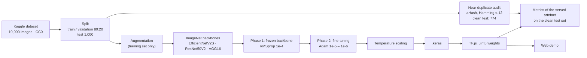
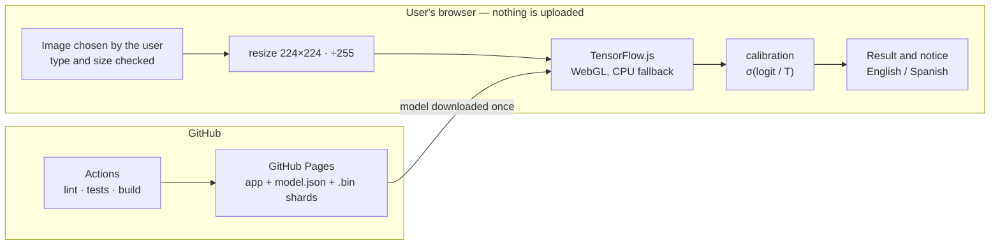

# Melanoma detection with transfer learning (VGG16 · ResNet50V2 · EfficientNetV2S)

**English** · [Español](README.es.md)

Binary classification of dermoscopic images (benign / malignant) with
*transfer learning*. Three reference architectures are compared under the same
protocol, and the selected model is served in a web demo that runs inference in
the user's browser.


**Live demo:** https://abarriuso.github.io/melanoma-detection/ (English and Spanish)

## Screenshots

| Desktop | Mobile |
|:---:|:---:|
|  |  |

> **Notice.** This is an academic project and a proof of concept. **It is not a
> medical device, it has not been clinically validated and it must not be used
> to make health decisions.** Its results come from a single public dataset and
> do not represent performance in real clinical conditions. If a lesion looks
> suspicious, see a dermatologist. Full text in [DISCLAIMER.md](DISCLAIMER.md).

---

## Contents

- [Motivation and scope](#motivation-and-scope)
- [Data](#data)
- [Method](#method)
- [Models compared](#models-compared)
- [Results](#results)
- [Interpretability and calibration](#interpretability-and-calibration)
- [System architecture](#system-architecture)
- [Repository layout](#repository-layout)
- [Installation and use](#installation-and-use)
- [Limitations](#limitations)
- [Ethical and clinical considerations](#ethical-and-clinical-considerations)
- [References](#references)
- [Licence and data](#licence-and-data)
- [Author](#author)

---

## Motivation and scope

Melanoma is one of the most aggressive skin cancers, and clinical evidence links
early detection with a better prognosis [1]. Over the last decade, convolutional
neural networks (CNNs) have shown they can classify skin lesions from images, in
some studies at a level comparable to dermatologists on limited test sets [2].
Those results are obtained under controlled conditions and are not equivalent to
clinical validation.

The scope of this work is **educational**: to reproduce, rigorously and
transparently, a complete binary classification workflow (benign / malignant)
—from training to deployment— and to compare three well-known architectures. It
is not meant to be a diagnostic system and claims no clinical usefulness.

## Data

The *Melanoma Skin Cancer Dataset* (10,000 images, CC0 licence) published on
Kaggle is used [3]. It is split into training and test sets, with an internal
80/20 partition for validation. The test set holds 1,000 images, 500 per class.

**Known biases of the dataset** (relevant when reading the results):

- It is **artificially balanced 50/50**. The real prevalence of melanoma in
  clinical practice is far lower, so the positive predictive value observed here
  does not carry over to a real setting [4].
- It does not document the distribution of skin phototypes, the equipment or the
  capture conditions. A model trained on it may generalise poorly to other
  populations or devices.
- It comes from a single source: without external validation, out-of-domain
  generalisation cannot be estimated.

## Method

The protocol is shared by the three architectures so the comparison is fair:

- **Transfer learning** from ImageNet pre-trained weights [5], a standard
  technique when the target dataset is small [6].
- **Two-phase training:** (1) feature extraction with the *backbone* frozen
  (RMSprop, lr 1e-4); (2) *fine-tuning* of the upper layers (Adam, lr 1e-5–1e-6).
  *Callbacks*: `ModelCheckpoint` (best `val_loss`), `EarlyStopping` and
  `ReduceLROnPlateau`.
- **Data augmentation** on the training set only: flips, rotation, zoom,
  translation, brightness and contrast.
- **Class weighting** `class_weight = {0: 1.0, 1: 1.3}` to penalise errors on the
  malignant class more and favour sensitivity [4].
- **Reproducibility:** fixed seed (42), 224×224 input, the same data pipeline for
  the three models.

Each model **bakes its specific preprocessing into the graph**, so the exported
model is self-contained and the client needs no per-model logic.

Training ran on Kaggle (T4 GPU) with a joint notebook that trains the three
architectures in a single run
([`notebooks/entrenamiento_conjunto_kaggle.ipynb`](notebooks/entrenamiento_conjunto_kaggle.ipynb)).

The whole pipeline, from the dataset to the demo:



## Models compared

| Model | Preprocessing (in the graph) | Fine-tuning (phase 2) | Phase 2 LR | Grad-CAM layer (notebooks) | Reference |
|-------|------------------------------|-----------------------|:----------:|----------------------------|-----------|
| **EfficientNetV2S** | `Rescaling(255)` + Keras built-in preprocessing | ~50 % of layers (BatchNorm frozen) | 1e-5 | `top_conv` | Tan & Le, 2021 [7] |
| ResNet50V2 | `Rescaling(2, offset=-1)` → [-1, 1] | ~80 non-BN layers (BatchNorm frozen) | 1e-6 | `post_relu` | He et al., 2016 [8] |
| VGG16 | `preprocess_input(x·255)` (BGR + Caffe means) | Last 4 layers (block 5) | 1e-5 | `block5_conv3` | Simonyan & Zisserman, 2015 [9] |

In ResNet50V2 and EfficientNetV2S, `BatchNorm` is frozen during *fine-tuning*:
its statistics degrade easily when retraining with small batches.

## Results

Metrics on the **clean** test set (774 images after excluding 226 contaminated
by duplicates or near-duplicates in train; see
[`scripts/dedup_test.py`](scripts/dedup_test.py)). Accuracy, sensitivity,
specificity, PPV, F1 and FN come from re-evaluating the artefact served in the
demo ([`scripts/reval_tfjs.mjs`](scripts/reval_tfjs.mjs): TF.js weights stored
as `uint8` and run in float32, with the same preprocessing as the client). The
AUC of EfficientNetV2S and ResNet50V2 comes from the original `.keras` model;
the VGG16 AUC from the TF.js artefact.

| Model | Accuracy | AUC | Sensitivity | Specificity | PPV (malignant) | Macro F1 | T | FN |
|-------|:---:|:---:|:---:|:---:|:---:|:---:|:---:|:---:|
| **EfficientNetV2S** | **87.1 %** | **0.971** | **90.0 %** | **84.4 %** | **84.1 %** | **0.87** | 1.184 | **37** |
| ResNet50V2 | 89.1 % | 0.969 | 84.6 % | 93.3 % | 92.1 % | 0.89 | 1.022 | 57 |
| VGG16 | 88.5 % | 0.957 | 82.5 % | 94.0 % | 92.7 % | 0.88 | 1.336 | 65 |

*95 % Wilson intervals on the clean test set — accuracy: EfficientNetV2S
84.5–89.3 %, ResNet50V2 86.8–91.1 %, VGG16 86.1–90.6 %; sensitivity: 86.6–92.7 %,
80.6–87.9 %, 78.3–86.0 %; specificity: 80.5–87.6 %, 90.4–95.4 %, 91.3–96.0 %.
Sensitivity = recall of the malignant class. PPV = positive
predictive value = precision on malignant. T = calibration temperature. FN =
missed melanomas. Precision, F1 and confusion matrices use a 0.5 threshold.*

> **Note on test contamination.** A later audit found that ~23 % of the original
> test set (226/1,000 images) has near-duplicates in train (aHash 16×16
> perceptual hash, Hamming distance ≤ 12). The original metrics on the 1,000
> images were an optimistic bound: EfficientNetV2S 91.6 %, ResNet50V2 90.9 %,
> VGG16 90.3 %. The figures in the table above are the evaluation on the clean
> subset.

### Confusion matrix — EfficientNetV2S (clean test set)

|  | Pred. benign | Pred. malignant |
|---|:---:|:---:|
| **Actual benign** | 340 (TN) | 63 (FP) |
| **Actual malignant** | 37 (FN) | 334 (TP) |

### How to read these numbers (with caution)

- **The differences between the three models are small** (AUC 0.957–0.971).
  With **a single training run**, no cross-validation and no confidence
  intervals, those differences could fall within the random variability between
  runs. No model should be called categorically "better" on these figures.
- The original test set had ~23 % of images with duplicates or near-duplicates in
  train; excluding them shifts sensitivity and specificity asymmetrically,
  because the removed images are not a random sample.
- The **37 false negatives** (melanomas classified as benign) are the most
  serious clinical error. Class weighting pushes towards sensitivity at the cost
  of more false positives; in a real setting the decision threshold should also
  be lowered below 0.5.
- The PPV (~84 %) is inflated by the 50/50 balance of the test set. With the real
  (much lower) prevalence the PPV would be substantially lower; the
  Precision-Recall curve reflects that regime better than the ROC [4], [15].

## Interpretability and calibration

- **Grad-CAM** [10] and **Grad-CAM++** [11] heatmaps are produced in the training
  notebooks (section 7) to check whether the model attends to the lesion rather
  than to background artefacts (hair, rulers, reflections). They are a
  qualitative aid, **not a localisation of the cancer**, and they are not part of
  the web demo.
- **Temperature scaling calibration** [12]: adjusts the model's confidence so
  that an 80 % probability really means ~80 % accuracy. Each model's temperature
  `T` is also applied in the client, so the confidence shown is honest.
- **Uncertainty with *MC Dropout*** [13]: several inferences with *dropout*
  active estimate how much the model "hesitates". The demo does not expose this
  signal yet.

## System architecture

The design principle is to move computation to the client: inference runs in the
browser with TensorFlow.js, with no *backend*. **The user's image never leaves
their device.**



| Layer | Environment | Responsibility |
|-------|-------------|----------------|
| Training | Kaggle / Colab (GPU) | Train and export the models |
| Inference | User's browser | Classify with TensorFlow.js |
| Hosting | GitHub Pages + Actions | Serve static files and automate deployment |

The `.keras` model is converted to TF.js with `uint8` quantisation (the default
one weighs ~21 MB) and served as static files. The app uses React 19 + Vite, with
tensor memory management (`tf.tidy` + `dispose`) and validation of the uploaded
image (type and size). The interface is available in English and Spanish.

## Repository layout

```
.
├── notebooks/
│   ├── entrenamiento_conjunto_kaggle.ipynb   The 3 backbones in one run (Kaggle)
│   ├── vgg16.ipynb · resnet50v2.ipynb · efficientnetv2s.ipynb
├── demo/                     Web demo (React + TensorFlow.js)
│   ├── src/                  App, inference (lib/model.js), translations (lib/strings.js), constants
│   └── public/model/<id>/    TF.js models (model.json + .bin shards)
├── scripts/
│   ├── convert_kaggle_output.py   .keras → TF.js (local / WSL / Kaggle)
│   ├── kaggle_convert_cell.py     Conversion cell for Kaggle
│   ├── convert-to-tfjs.mjs        Alternative conversion with Node
│   ├── gen-notebooks.mjs · gen-og.mjs · download_dataset.ps1
├── models/                   Metrics and notes (the .keras files are gitignored)
├── .github/workflows/        ci.yml + deploy.yml (GitHub Pages)
├── requirements.txt · LICENSE · DISCLAIMER.md · CONTRIBUTING.md
```

Excluded from the repository (`.gitignore`): `*.keras` (~184 MB), the dataset
(`archive/`) and `node_modules/`.

## Installation and use

The repository uses **pnpm** for the demo.

### Training

Open the joint notebook on Kaggle with a T4 GPU and run it. Add the dataset [3]
from the *Data* panel. It trains, evaluates (clinical metrics, calibration,
Grad-CAM) and saves each `.keras`.

> The notebooks are generated with `node scripts/gen-notebooks.mjs` (the source
> of truth); do not edit the `.ipynb` files by hand.

### Converting the weights to TF.js

If the training environment did not have `tensorflowjs`, convert the `.keras`
files without retraining:

```bash
python scripts/convert_kaggle_output.py     # Linux / WSL / Kaggle
```

On native Windows `tensorflowjs` does not install (because of
`tensorflow-decision-forests`); use WSL or Kaggle. Copy the result to
`demo/public/model/<id>/`.

### Running the demo locally

```bash
cd demo
pnpm install
pnpm dev        # http://localhost:5173
pnpm build      # production build
pnpm lint
pnpm test
```

Deployment to GitHub Pages is automatic on every push to `main` (Actions).

## Limitations

- **No external validation.** A single dataset; generalisation to others (ISIC,
  HAM10000 [14]) is unknown.
- **Mixed AUC sources:** the AUC of EfficientNetV2S and ResNet50V2 comes from the
  original `.keras` model, while every other metric comes from the served
  artefact.
- **Contaminated test set:** 226/1,000 images of the original test set had
  duplicates or near-duplicates in train; although they are excluded from the
  main table, the original split was not designed with a per-lesion or
  per-patient separation.
- **No cross-validation.** The confidence intervals above overlap: differences
  between models may be due to chance.
- **Prevalence mismatch:** the 50/50 test set does not reflect clinical practice;
  the PPV does not carry over directly.
- **No subgroup analysis** by age, sex, phototype or capture device.
- **No external calibration:** the temperature was fitted on data from the same
  source; it does not guarantee calibrated probabilities out of distribution.
- **Quantisation not evaluated:** there is no systematic comparison between the
  float32 `.keras` model and the `uint8` TF.js one.
- **Risk of artefacts:** Grad-CAM may highlight backgrounds or markers instead of
  the lesion.
- **Clinical use:** it is not a medical device and must not replace a
  professional assessment.

## Ethical and clinical considerations

The project does not aim to replace the assessment of a healthcare
professional. A classifier can produce false negatives and false positives, and
its performance can vary with the population, the device and the capture
conditions. No clinical decisions should be made based on this demo.

## References

[1] Gershenwald, J. E., Scolyer, R. A., Hess, K. R., et al. (2017). Melanoma
staging: Evidence-based changes in the American Joint Committee on Cancer eighth
edition cancer staging manual. *CA: A Cancer Journal for Clinicians, 67*(6),
472–492. https://doi.org/10.3322/caac.21409

[2] Esteva, A., Kuprel, B., Novoa, R. A., Ko, J., Swetter, S. M., Blau, H. M., &
Thrun, S. (2017). Dermatologist-level classification of skin cancer with deep
neural networks. *Nature, 542*(7639), 115–118. https://doi.org/10.1038/nature21056

[3] Javed, H. (n.d.). *Melanoma skin cancer dataset of 10000 images* [Data set].
Kaggle. https://www.kaggle.com/datasets/hasnainjaved/melanoma-skin-cancer-dataset-of-10000-images

[4] He, H., & Garcia, E. A. (2009). Learning from imbalanced data. *IEEE
Transactions on Knowledge and Data Engineering, 21*(9), 1263–1284.
https://doi.org/10.1109/TKDE.2008.239

[5] Deng, J., Dong, W., Socher, R., Li, L.-J., Li, K., & Fei-Fei, L. (2009).
ImageNet: A large-scale hierarchical image database. In *2009 IEEE Conference on
Computer Vision and Pattern Recognition* (pp. 248–255).
https://doi.org/10.1109/CVPR.2009.5206848

[6] Pan, S. J., & Yang, Q. (2010). A survey on transfer learning. *IEEE
Transactions on Knowledge and Data Engineering, 22*(10), 1345–1359.
https://doi.org/10.1109/TKDE.2009.191

[7] Tan, M., & Le, Q. V. (2021). EfficientNetV2: Smaller models and faster
training. In *Proceedings of the 38th International Conference on Machine
Learning* (PMLR 139, pp. 10096–10106). https://arxiv.org/abs/2104.00298

[8] He, K., Zhang, X., Ren, S., & Sun, J. (2016). Identity mappings in deep
residual networks. In *Computer Vision – ECCV 2016* (LNCS 9908, pp. 630–645).
https://doi.org/10.1007/978-3-319-46493-0_38

[9] Simonyan, K., & Zisserman, A. (2015). Very deep convolutional networks for
large-scale image recognition. In *3rd International Conference on Learning
Representations (ICLR)*. https://arxiv.org/abs/1409.1556

[10] Selvaraju, R. R., Cogswell, M., Das, A., Vedantam, R., Parikh, D., & Batra,
D. (2017). Grad-CAM: Visual explanations from deep networks via gradient-based
localization. In *2017 IEEE International Conference on Computer Vision* (pp.
618–626). https://doi.org/10.1109/ICCV.2017.74

[11] Chattopadhay, A., Sarkar, A., Howlader, P., & Balasubramanian, V. N. (2018).
Grad-CAM++: Generalized gradient-based visual explanations for deep
convolutional networks. In *2018 IEEE Winter Conference on Applications of
Computer Vision* (pp. 839–847). https://doi.org/10.1109/WACV.2018.00097

[12] Guo, C., Pleiss, G., Sun, Y., & Weinberger, K. Q. (2017). On calibration of
modern neural networks. In *Proceedings of the 34th International Conference on
Machine Learning* (PMLR 70, pp. 1321–1330). https://arxiv.org/abs/1706.04599

[13] Gal, Y., & Ghahramani, Z. (2016). Dropout as a Bayesian approximation:
Representing model uncertainty in deep learning. In *Proceedings of the 33rd
International Conference on Machine Learning* (PMLR 48, pp. 1050–1059).
https://arxiv.org/abs/1506.02142

[14] Tschandl, P., Rosendahl, C., & Kittler, H. (2018). The HAM10000 dataset, a
large collection of multi-source dermatoscopic images of common pigmented skin
lesions. *Scientific Data, 5*, 180161. https://doi.org/10.1038/sdata.2018.161

[15] Saito, T., & Rehmsmeier, M. (2015). The precision-recall plot is more
informative than the ROC plot when evaluating binary classifiers on imbalanced
datasets. *PLOS ONE, 10*(3), e0118432. https://doi.org/10.1371/journal.pone.0118432

## Licence and data

The code is released under the MIT licence. The dataset is not included in the
repository and keeps the terms of its original source.

## Author

Adrián Barriuso Pizarro ([@abarriuso](https://github.com/abarriuso))
